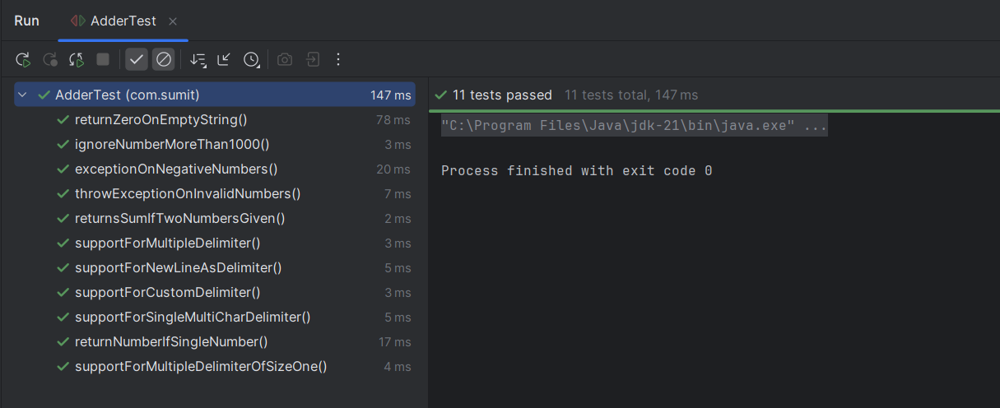

# String Calculator – TDD Kata Solution

## Table of Contents

- [Problem Overview](#-problem-overview)
- [What is TDD?](#-what-is-tdd)
- [TDD Approach in This Project](#-tdd-approach-in-this-project)
- [Technologies Used](#️-technologies-used)
- [Project Structure](#-project-structure)
- [Test Cases Covered](#-test-cases-covered)
- [How to Run](#-how-to-run)
- [Final Thoughts](#-final-thoughts)

---

## Problem Overview

This kata is a simplified calculator that takes a string input and returns the sum of the numbers in it. It starts with basic functionality (summing two numbers) and evolves step-by-step into a robust calculator that supports:

- Custom delimiters
- Multiple/multi-character delimiters
- Error handling (e.g., negative numbers, invalid inputs)

---

## What is TDD?

**Test-Driven Development (TDD)** is a software development approach where we:

1. **Write a failing test** that defines a desired improvement or new function.
2. **Write the minimum amount of code** to pass the test.
3. **Refactor** the code while keeping tests green (passing).

🔁 **Red → Green → Refactor**

This cycle enforces:
- Simple, readable code
- Early bug detection
- Developer confidence via automated tests

---

## TDD Approach in This Project

This String Calculator was built strictly using the **TDD cycle**:

| Step        | Action Taken |
|-------------|--------------|
| 🔴 Red      | Wrote failing tests for empty strings, basic inputs |
| 🟢 Green    | Implemented minimal logic to pass them |
| 🔄 Refactor | Modularized logic using helper methods |

Each enhancement (custom delimiters, multi-delimiters, validation) followed its own TDD loop, ensuring clean, testable code.

---

## Technologies Used

- **Java 21**
- **JUnit 5** – for writing and running unit tests
- **IntelliJ IDEA** – for development
- **Maven** – for project structure and dependency management

---

## Project Structure

```
StringCalculatorTDD/
│
├── src/
│   └── main/
│       └── java/
│           └── com/sumit/
│               └── Adder.java          # Main calculator class
│
└── test/
    └── java/
        └── com/sumit/  
            └── AdderTest.java          # JUnit test class
```

---

## Test Cases Covered

> ⚠️ All scenarios were implemented and tested incrementally as per the original kata specification.

### 1. Basic Cases
- Empty string returns `0`
- Single number returns itself
- Two numbers return their sum
- Supports commas and newlines as delimiters

### 2. Unknown Number of Inputs
- Supports variable number of integers

### 3. Custom Delimiters
- Single-char custom delimiter: `//;\n1;2`
- Delimiters with any length: `//[***]\n1***2***3`

### 4. Multiple Delimiters
- Multiple single-char delimiters: `//[*][%]\n1*2%3`
- Multiple multi-char delimiters: `//[**][%%]\n1**2%%3`

### 5. Validation and Error Handling
- Throws exception on negative numbers: `"negatives not allowed -1 -2"`
- Throws exception on invalid inputs: `"Invalid numbers found: a, %, xyz"`
- Ignores numbers > 1000

### All Test Cases Passing

Below is a screenshot showing all unit tests passing successfully:



---

## How to Run

### Requirements :
- JDK 21+
- Maven
- IntelliJ IDEA (Recommended)

### ▶ Run Tests

```bash
mvn test
```

> Or right-click `AdderTest.java` in IntelliJ and choose "Run Tests"

---

## Sample Test

```java
@Test
void supportsMultipleMultiCharDelimiters() {
    Adder adder = new Adder();
    assertEquals(25, adder.add("//[#][$][%][&]\n3$4#5&6%7"));
}
```

---

## Final Thoughts

This project demonstrates my understanding and application of:

- **Test-Driven Development (TDD)**
- **JUnit-based testing**
- **Clean code and modular design**

---

## 🙏 Thank You!

Thank you to **Incubyte** for giving assessments like this to let us deep dive into the world of test driven development. I thoroughly enjoyed building this project.


— **Sumit Gohil**
